<div align="center">
  <h1> Nagrik AI (UrbanEye)</h1>
  <p><b>Smart City Infrastructure Auditor & AI-Powered Reporting Platform</b></p>
</div>

Nagrik AI is a state-of-the- art platform designed to bridge the gap between citizens and city authorities. Using **Gemini 2.5 Flash AI** and **Redis Geohashing**, it automates the validation, deduplication, and verification of civic issues like potholes, garbage, and broken streetlights.

## 📸 Platform Overview

### 🏡 Beautiful Landing Page (Official Logo & Branding)
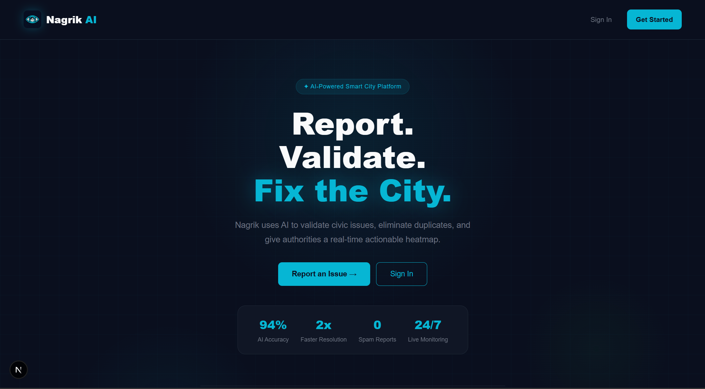

### 📊 Citizen Dashboard & Activity Monitoring
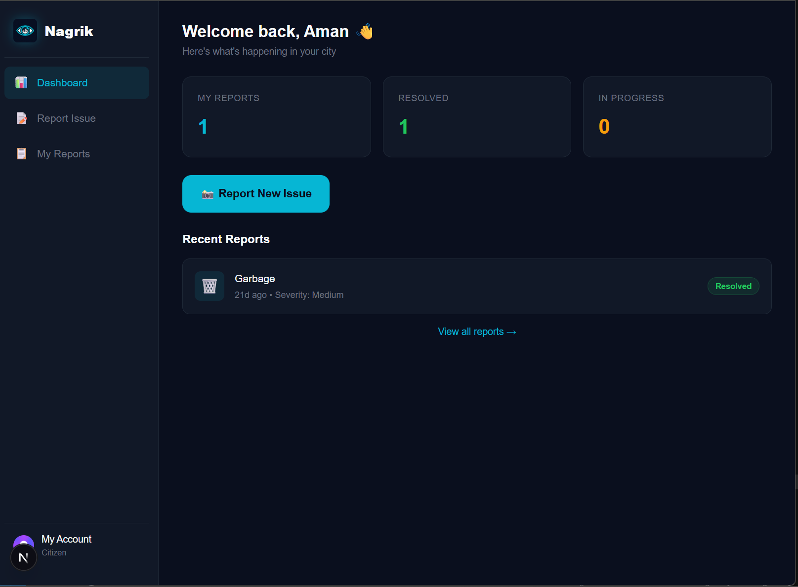

### 📝 AI-Powered Reporting Form (Category & Photo)
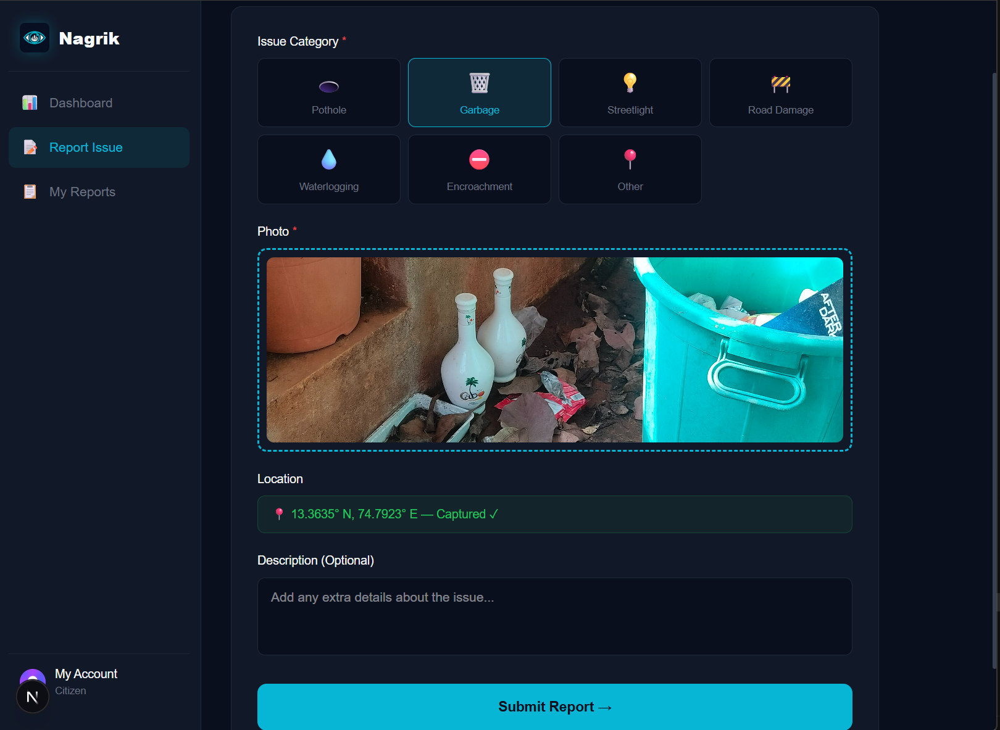

### 📋 User's Reported Incidents
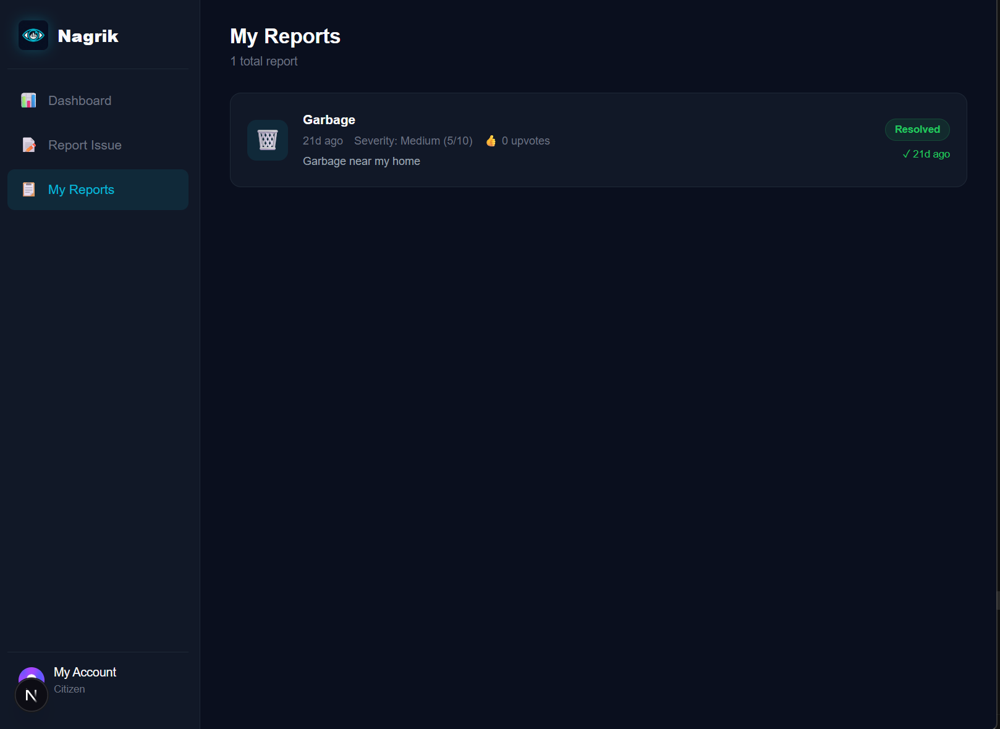

### 🛡️ Admin Dashboard (Live Severity Heatmap)
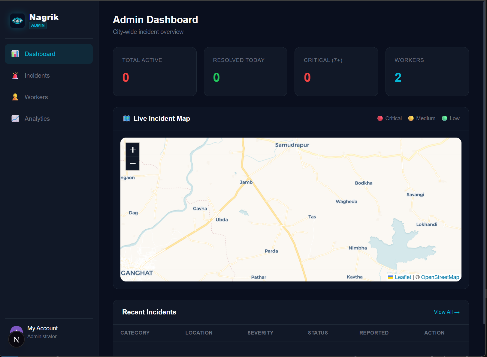

### 🚨 Real-time Incident Monitoring (Admin View)
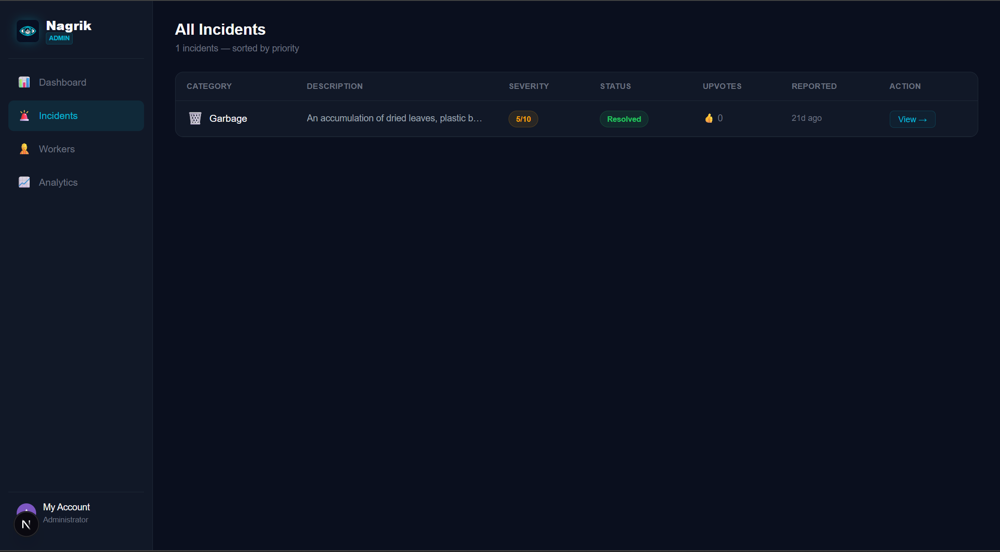

### 🛠️ AI-Driven Dual Verification (Before/After Analysis)
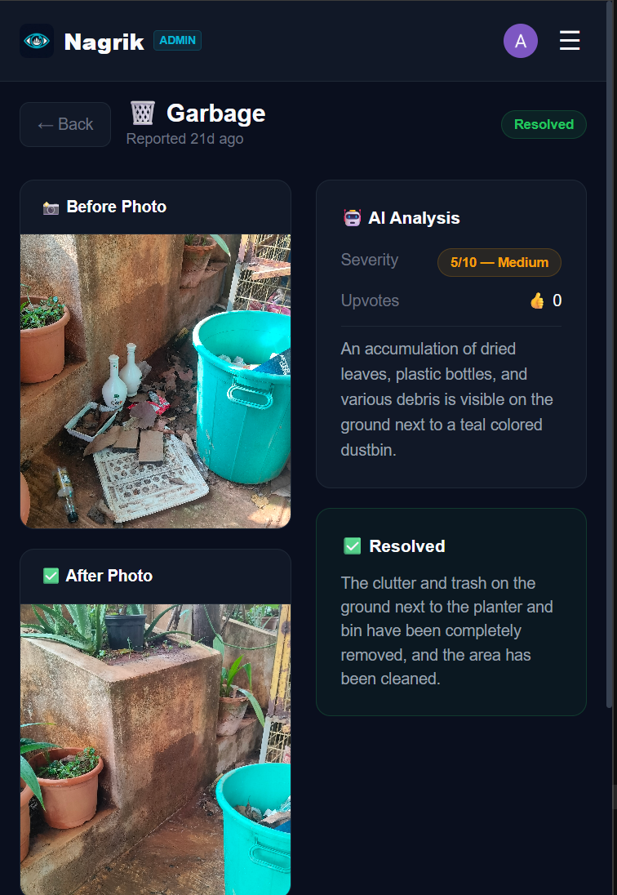

### 🗺️ Precise Geographic Location Mapping
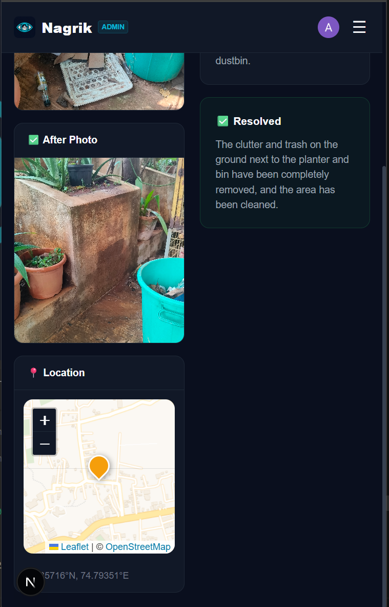

### 👷 Worker Management & Performance Overview
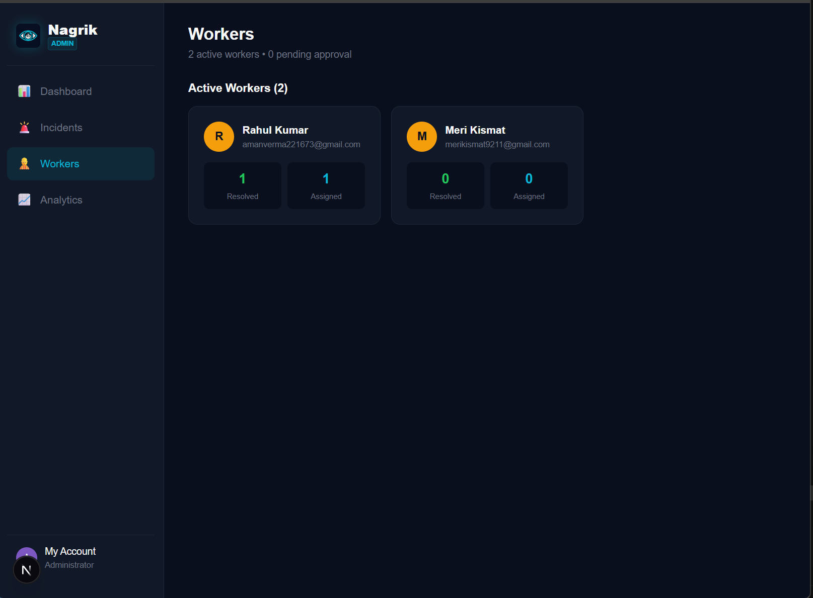

### 📈 Smart City Analytics & Resolution Rates
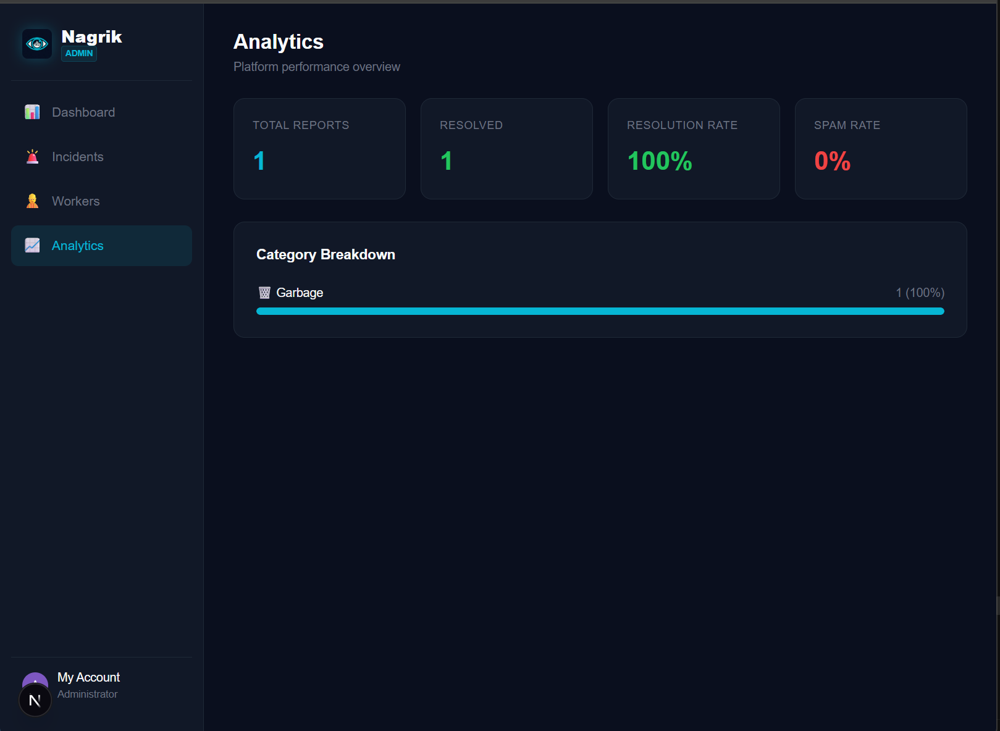

### 📋 Worker Task List & Resolution Flow
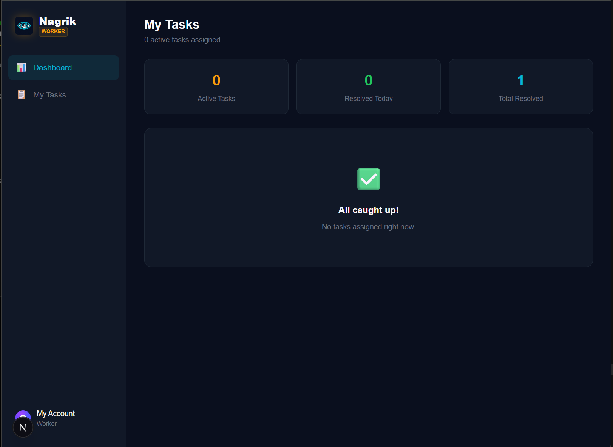
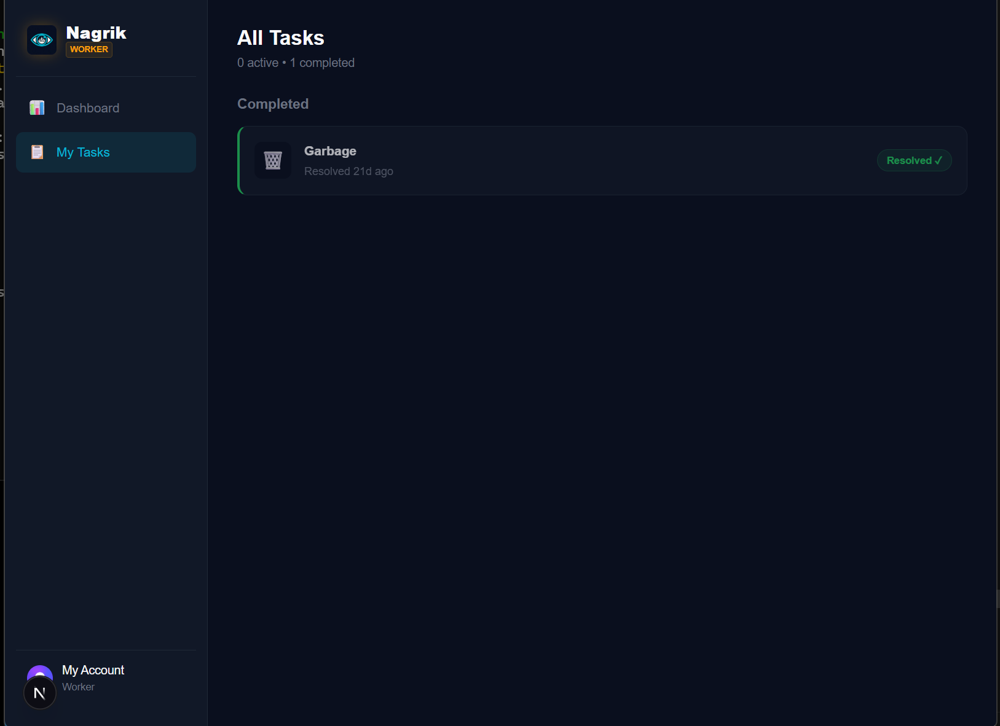

---

## 🛑 Problem Statement
Civic issue reporting in modern cities is often broken:
- **Spam & False Reports:** Authorities are overwhelmed by low-quality or fake reports.
- **Deduplication:** Multiple people report the same pothole, creating redundant data.
- **Lack of Verification:** No automated way to proof that a worker actually fixed the issue correctly.
- **Slow Response:** Manual sorting of reports delays resolution of critical hazards.

## ✨ Key Functionalities
- **AI-Powered Validation:** Uses Gemini AI to analyze photos in real-time, detecting spam, categorizing issues, and assigning severity scores (1-10).
- **Smart Deduplication:** Implements **Redis Geohashing** (precision ~20m) to check if an issue in the same category has already been reported nearby.
- **Dual Verification:** Workers must submit an "After" photo, which the AI compares against the "Before" photo to verify the fix.
- **Real-time Heatmaps:** Admin dashboard features a live Map with severity-coded markers for city-wide monitoring.
- **4-Tier Role System:** Dedicated dashboards and flows for `Citizen`, `Worker`, `Admin`, and `Pending Worker`.

## 🛠️ Tech Stack
- **Framework:** Next.js 14 (App Router)
- **Language:** TypeScript (Strict Mode)
- **Authentication:** Clerk Auth
- **Database:** MongoDB (Mongoose)
- **Cache/Real-time:** Upstash Redis (Geohashing, Rate Limiting)
- **AI Engine:** Google Gemini AI (Generative AI SDK)
- **Storage:** AWS S3 (Direct uploads with Presigned URLs)
- **Map Engine:** Leaflet & React-Leaflet
- **Styling:** Vanilla CSS & Tailwind (Hybrid)

## 🛡️ Security Measures
- **Role-Based Access Control (RBAC):** Middleware and Database-level enforcement of roles.
- **S3 Presigned URLs:** Secure, time-limited direct-to-S3 uploads (no image data passes through the server).
- **Spam Filtering:** Automated binary spam check + confidence scoring by AI before saving to DB.
- **API Rate Limiting:** Redis-based rate limiting to prevent submission flooding.
- **Webhook Security:** Webhook signature verification using **Svix** for Clerk events.
- **Environmental Security:** Zero exposure of secret keys to the client-side.

## 📂 Detailed Project Structure
```text
├── app/                      # Next.js App Router (Main logic)
│   ├── (auth)/               # Auth flows (Sign-in, Sign-up)
│   ├── (citizen)/            # Citizen-facing pages
│   │   ├── dashboard/        # KPIs & Recent activity
│   │   ├── my-reports/       # User-specific incident lists
│   │   └── report/           # AI-powered reporting form
│   ├── admin/                # Admin-facing management
│   │   ├── dashboard/        # Live heatmap & City overview
│   │   ├── incidents/        # Incident monitoring & assignment
│   │   └── workers/          # Worker approval & list management
│   ├── worker/               # Worker-facing task resolution
│   │   ├── dashboard/        # Personal task list & stats
│   │   └── tasks/            # Specific task detail & resolution
│   ├── api/                  # Backend endpoints (Edge/Serverless)
│   │   ├── auth/             # Role registration & role metadata
│   │   ├── incidents/        # Incident creation, fetching & upvoting
│   │   ├── upload/           # S3 Presigned URL & S3 key generation
│   │   ├── workers/          # Worker approval & data retrieval
│   │   └── webhooks/         # Clerk & Svix signature verification
│   └── layout.tsx            # Root layout with Theme & Auth providers
├── components/               # UI components & shared layouts
│   ├── Map.tsx               # Leaflet-based incident visualization
│   ├── MapWrapper.tsx        # Client-side map wrapper for Next.js
│   ├── Civicsensesection.tsx # Civic tips & AI-driven info cards
│   ├── FAQSection.tsx        # Dynamic FAQ with smooth transitions
│   └── Footer.tsx            # Global site footer
├── lib/                      # Core infrastructure logic
│   ├── ai/                   # AI Prompt engineering (Gemini Flash)
│   ├── aws/                  # S3 Client, Key gen & URL signing
│   ├── db/                   # MongoDB Connection (Mongoose) & Models
│   ├── redis/                # Geohashing (ngeohash) & Rate Limiting
│   └── utils/                # Date/time formatters, Status labels & badge maps
├── public/                   # Static assets (Favicon, Logo, etc.)
├── types/                    # End-to-end TypeScript interfaces & Enums
├── middleware.ts             # Clerk auth & Role-based route protection
├── next.config.ts            # Next.js configuration (Server actions & body limits)
└── tailwind.config.ts        # Design tokens & color system
```

## ⚙️ How to Get Started

### 1. Prerequisites
- Node.js 18+
- MongoDB & Upstash Redis instance
- AWS S3 Bucket
- Google Gemini API Key
- Clerk Project Keys

### 2. Environment Setup
Create a `.env.local` file:
```env
NEXT_PUBLIC_CLERK_PUBLISHABLE_KEY=
CLERK_SECRET_KEY=
DATABASE_URL=
UPSTASH_REDIS_REST_URL=
UPSTASH_REDIS_REST_TOKEN=
GEMINI_API_KEY=
AWS_REGION=
AWS_ACCESS_KEY_ID=
AWS_SECRET_ACCESS_KEY=
AWS_S3_BUCKET_NAME=
```

### 3. Installation
```bash
git clone https://github.com/your-repo/urbaneye-ai.git
cd urbaneye-ai
npm install
npm run dev
```

---
*Built with ❤️ for a smarter, cleaner city.*

